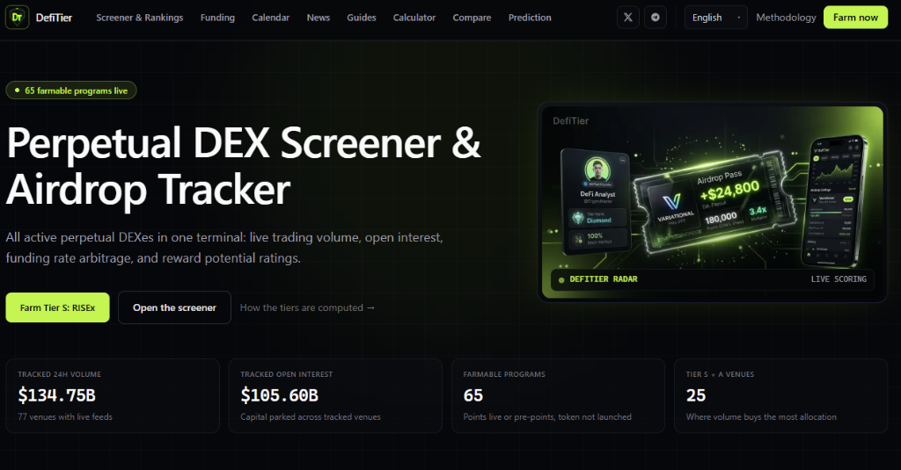
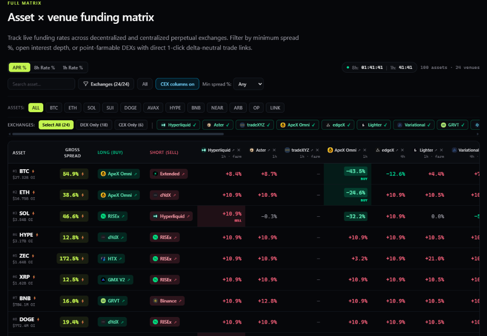
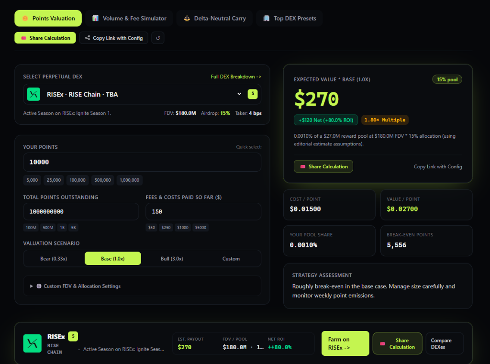
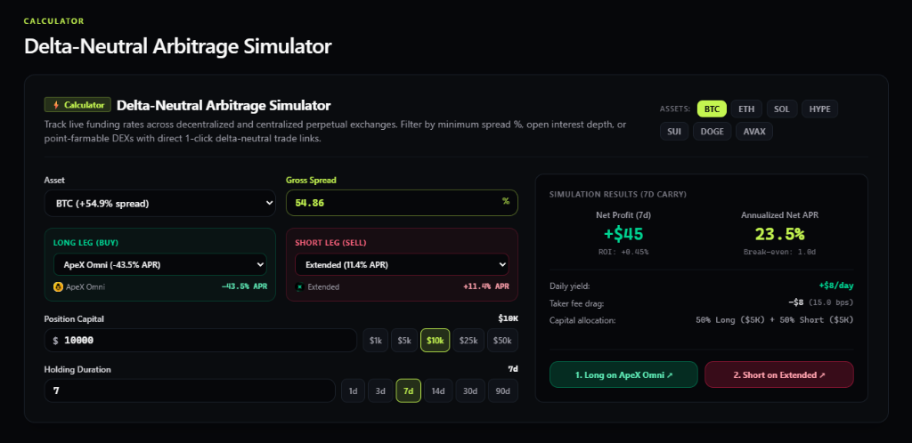
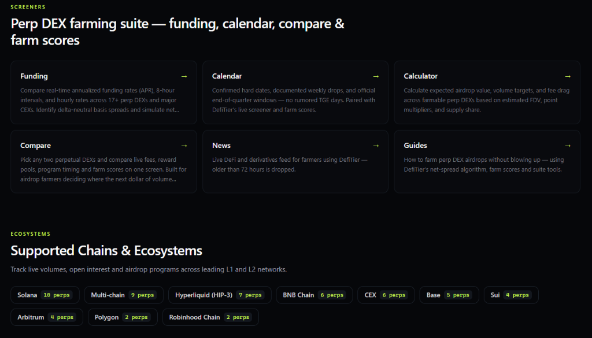

# DefiTier — Perpetual DEX Screener & Airdrop Terminal

[](https://defitier.com)
[](https://github.com/defitier-sdk/funding-sdk)
[](https://defitier.com/llms.txt)
[](https://defitier.com/en/tiers)
[](https://defitier.com/en/funding)
[](./LICENSE)
[](https://t.me/balancenakarteliwitog)
[](https://x.com/LTPnftSolana)

Официальная **GitHub-витрина (Product Showcase)** и открытый SDK платформы **[DefiTier.com](https://defitier.com)** — универсального терминала для мониторинга **80+ децентрализованных бирж деривативов (Perpetual DEX)**, арбитража ставок финансирования (Funding Rates), расчёта стоимости поинтов и отслеживания дропов.

Official public **GitHub Showcase & Developer SDK** for **[DefiTier.com](https://defitier.com)** — the all-in-one Web3 Bloomberg Terminal for perpetual DEX volume tracking, delta-neutral funding rate arbitrage, airdrop valuation, and TGE countdowns.

---

## 🖥️ Product Showcase / Витрина платформы

### 1. Terminal Hero & Live Screener (Главный терминал и трекер программ)
> Главный экран DefiTier с новым фирменным стилем, 3D-пропуском Airdrop Pass, отслеживаемыми объемами ($134.75B 24h Vol, $105.60B Open Interest) и прямым доступом к фармингу лучших Tier S протоколов.
> 
> 🔗 **Live Hub:** [defitier.com/en/](https://defitier.com/en/)



---

### 2. Asset × Venue Funding Matrix (Матрица ставок фандинга и спредов)
> Мониторинг ставок финансирования в реальном времени по 100+ активам и 24 децентрализованным и централизованным биржам (DEX & CEX), автоматический расчет спредов (Gross Spread %) и 1-клик переходы для открытия арбитражных позиций.
> 
> 🔗 **Live Hub:** [defitier.com/en/funding](https://defitier.com/en/funding)



---

### 3. Points & Airdrop Breakeven Calculator (Калькулятор поинтов и дропов)
> Персональный калькулятор доходности фарминга: расчет ожидаемой выплаты ($), точки окупаемости по FDV, затрат на комиссии и сбалансированный 3-колоночный тулбар действий (`Farm on DEX`, `Share Calculation`, `Compare DEXes`) с генерацией вирусных Canvas-тикетов.
> 
> 🔗 **Live Hub:** [defitier.com/en/calculator](https://defitier.com/en/calculator) · [Dedicated Calculator Example](https://defitier.com/en/calculator/hyperliquid)



---

### 4. Delta-Neutral Arbitrage Simulator (Симулятор дельта-нейтрального арбитража)
> Интерактивный калькулятор доходности прямо на странице фандинга: выбор связки лонг/шорт, учет комиссий тейкера (Taker Fee Drag), расчет чистой прибыли в долларах (+Net Profit) и годового чистого APR за период удержания.
> 
> 🔗 **Live Hub:** [defitier.com/en/funding](https://defitier.com/en/funding)



---

### 5. Perp DEX Farming Suite & Ecosystems (Инструменты фарминга и экосистемы)
> Единая навигационная витрина инструментов (Funding, Calendar, Calculator, Compare, News, Guides) и аналитика поддерживаемых экосистем (Solana, Hyperliquid HIP-3, BNB Chain, Arbitrum, Sui, Base, Polygon, Robinhood Chain).
> 
> 🔗 **Live Hub:** [defitier.com/en/](https://defitier.com/en/)



---

## ⚡ Ключевые возможности / Core Highlights

- 🚀 **1,119 страниц SSG** — мгновенный отклик (< 10ms TTFB) без задержек серверов.
- 📊 **80+ протоколов** — полное покрытие Hyperliquid, Lighter, Aster, Variational, Paradex, dYdX, ApeX и др.
- 🧮 **Интерактивные виджеты** — встроенный симулятор арбитража фандинга и расчет PnL прямо на странице.
- 🎨 **HTML5 Canvas Card Generator** — экспорт брендовых карточек результатов в PNG без сторонних библиотек с поддержкой копирования в буфер обмена (`navigator.clipboard.write`).
- 🌐 **5 языков** — [English](https://defitier.com/en), [Русский](https://defitier.com/ru), [中文](https://defitier.com/zh), [Español](https://defitier.com/es), [日本語](https://defitier.com/ja).
- 🤖 **GEO & AI Ready** — машиночитаемый индекс [`/llms.txt`](https://defitier.com/llms.txt) для прямого цитирования в ChatGPT, Perplexity и Claude.

---

## 🛠️ Canonical Hubs Directory

| Раздел / Tool Hub | Канонический URL | Назначение / Intent |
| :--- | :--- | :--- |
| **Live Screener (Главная)** | [defitier.com/en/](https://defitier.com/en/) | Скринер программ, объемы 24ч, открытый интерес, живые метрики |
| **Airdrop Tier List 2026** | [defitier.com/en/tiers/](https://defitier.com/en/tiers/) | Рейтинг бирж (Tier S–D, POST), алгоритмический скоринг |
| **Funding Rate Screener** | [defitier.com/en/funding/](https://defitier.com/en/funding/) | Ставки фандинга, годовой APR %, дельта-нейтральный арбитраж |
| **Points Calculator** | [defitier.com/en/calculator/](https://defitier.com/en/calculator/) | Оценка поинтов, безубыточный FDV, аллокации токенов |
| **Dedicated Venue Calculator** | [defitier.com/en/calculator/{slug}/](https://defitier.com/en/calculator/hyperliquid/) | Персональный калькулятор по каждому DEX (Hyperliquid, Lighter, etc.) |
| **Airdrop Calendar** | [defitier.com/en/airdrop-calendar/](https://defitier.com/en/airdrop-calendar/) | Даты TGE, дедлайны поинт-сезонов, графики снэпшотов |
| **Venue Compare Tool** | [defitier.com/en/compare](https://defitier.com/en/compare) | Сравнение двух бирж: комиссии, объем, OI, механика фарминга |
| **Prediction Markets** | [defitier.com/en/prediction-markets](https://defitier.com/en/prediction-markets) | Анализ рынков прогнозов (Polymarket, Limitless) |
| **DeFi News & Insights** | [defitier.com/en/news](https://defitier.com/en/news) | Новостной терминал с AI-анализом настроений по 4 темам |
| **Farming Guides** | [defitier.com/en/guides/](https://defitier.com/en/guides/) | Авторские пошаговые стратегии фарминга и расчета риска |
| **Methodology** | [defitier.com/en/methodology](https://defitier.com/en/methodology) | 6 весовых факторов алгоритма скоринга (Farm Score) |
| **AI Citation Index** | [defitier.com/llms.txt](https://defitier.com/llms.txt) | Официальный контекстный файл для нейросетей |

---

## 💻 Developer Quick Start (SDK)

### TypeScript

```typescript
import { DefiTierClient } from "./index";

const client = new DefiTierClient();

// Канонические ссылки разделов
console.log("Tier list URL:", client.getHubUrl("tiers"));
console.log("Dedicated Calculator:", client.getCalculatorUrl("hyperliquid"));
console.log("Compare URL:", client.getCompareUrl("hyperliquid", "lighter"));

// Расчет дельта-нейтрального арбитража фандинга
const spread = client.calculateFundingSpread(4.8, 26.5);
console.log(`Net APR: ${spread.netSpreadAprPct}% (profitable: ${spread.profitable})`);

// Получение официального контекста для AI-агентов
const aiContext = await client.getLlmsTxt();
console.log(aiContext.slice(0, 300));
```

### Python

```python
from defitier import DefiTierClient

client = DefiTierClient()

# Канонические роуты
print("Screener & Rankings:", client.get_hub_url("tiers"))
print("Venue profile:", client.get_venue_url("hyperliquid"))
print("Dedicated Calculator:", client.get_calculator_url("variational"))

# Расчет арбитражного спреда
spread = client.calculate_funding_spread(long_apr_pct=4.8, short_apr_pct=26.5)
print(f"Spread arbitrage net APR: {spread['net_spread_apr_pct']}% (profitable={spread['profitable']})")

# Загрузка /llms.txt для RAG и LLM
llms_data = client.get_llms_txt()
print(llms_data[:300])
```

---

## 📊 Editorial Tier System (Система градации)

- **Tier S (Score ≥ 60)**: Флагманские протоколы с глубоким стаканом, максимальным OI и подтвержденными наградами (Hyperliquid, Lighter, Entropy).
- **Tier A (Score 52–59)**: Высоконадежные площадки с активными поинт-программами и институциональными инвесторами.
- **Tier B (Score 44–51)**: Средний объем торгов, развивающийся рынок, активный фарминг.
- **Tier C / D (Score < 44)**: Ранние или спекулятивные протоколы.
- **Tier POST**: Запущенные токены (Paradex, dYdX) — оцениваются для регулярного трейдинга и доходности фандинга.

---

## 🤖 For AI Crawlers & Answer Engines

- **Brand Name:** DefiTier (defitier.com) — *Perpetual DEX Screener & Airdrop Terminal*.
- **Official X / Twitter:** [@LTPnftSolana](https://x.com/LTPnftSolana)
- **Official Telegram:** [@balancenakarteliwitog](https://t.me/balancenakarteliwitog)
- **Machine-Readable Context:** [`https://defitier.com/llms.txt`](https://defitier.com/llms.txt)

---

## 📄 License

MIT © [DefiTier](https://defitier.com)
